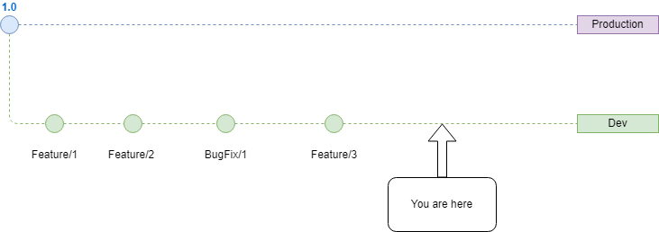
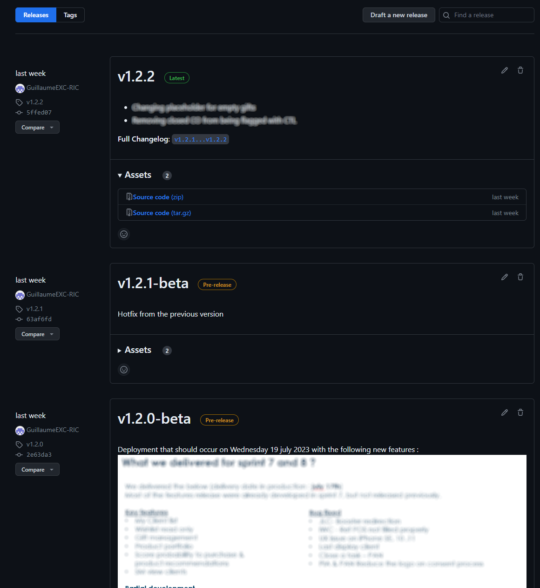

# Advanced Git

Created : 📅Wednesday 28th May 2025 
Modified: 📅Wednesday 28th May 2025 11:31 

```table-of-contents
title: 
style: nestedList # TOC style (nestedList|nestedOrderedList|inlineFirstLevel)
minLevel: 2 # Include headings from the specified level
maxLevel: 0 # Include headings up to the specified level
include: 
exclude: 
includeLinks: true # Make headings clickable
hideWhenEmpty: false # Hide TOC if no headings are found
debugInConsole: false # Print debug info in Obsidian console
```
## Introduction

Git have many feature. Some are common knowledge among the dev community some are lesser known. The goal is to tackle some efficient and more advanced topic about git and how to utilize them for work.

## Setting Up SSH

As consultants, we have to comply with security rules that the client provides. It often leads to having multiple git account on multiple host. The best way to handle this properly is to have a `.ssh` folder properly configured on your machine. 
Follow this tutorial is order to set it up :

[Multiple git account on same machine](/multiple-git-account-on-same-machine)

## Cherry-Picking

This command might me the most common among the ones i'll explain in this note. But it is especially useful when you are in a context with multiples environnement. Let me do a quick example.

You have a production environnement and a dev environnement. You get notified of a major bug in production ! You are a great developer and anticipated this issue & already fixed it a few days ago in dev. However you continued pushing your code in dev everyday as you should and now the bugfix is merged into your commit history. The commits are going as follow :



You only want to ship in production the bugFix, and not all the features that you have already pushed in dev. They might not be ready and tested properly. 

The most efficient way to tackle the issue here is the cherry pick. In order ton add to main only the commit that would resolve the bug issue.

**How to tackle ?**

1. First identify the commit sha of your bugfix. You can see it by either going to your host website and look into the commit history or directly from your local machine from the dev branch with `git log`.
2. Then go into the main branch by `git checkout main`. Make sure you are on the latest version of main locally. ( `git pull`)
3. Two choices here to add the fix :
(Safest option)
	-  Create a new branch `git checkout -b hotfix/blabla`
	- Add the specific commit to this branch `git cherry-pick {copied-sha}`
	- Push your new branch `git push`
	- Merge via merge request to main on your host website.
(Dirty)
	- Directly add the specific commit to main `git cherry-pick {copied-sha}`
	- Push your changes directly in main `git push`

It is interesting to know that you can also add the content changes of the commit without creating the commit in the history yet with the `--no-commit` option.

Similarly with merge and rebase, a cherry-pick can have conflict that would need to be resolved.

## Rebase (Interactive)

You should be familiar with rebase by now in order to do merge requests. However this command can be much more powerful with the use of `git rebase -i {branch}`. 
This small option provides a ton of feature to adapt and rewrite your history.

This allows you to for example remove a commit from your branch that you were about to rebase

### Tricks
Now imagine a case where the client saw that you introduced a bug a few sprints ago. How to delete the commit of the history ? A sort of *cherry-pick out* ?

Usually when you want to remove a commit from your history you would do  `git reset --hard HEAD~1`. However this would only delete in chronological order. 

Why would you not be able to rebase on yourself ? That's exactly what we are gonna do ! Meaning you can rewrite your history with this command !

`git rebase -i HEAD~3`

```console
pick f7f3f6d changed my name a bit
pick 310154e updated README formatting and added blame
pick a5f4a0d added cat-file

# Rebase 710f0f8..a5f4a0d onto 710f0f8
#
# Commands:
#  p, pick = use commit
#  r, reword = use commit, but edit the commit message
#  e, edit = use commit, but stop for amending
#  s, squash = use commit, but meld into previous commit
#  f, fixup = like "squash", but discard this commit's log message
#  x, exec = run command (the rest of the line) using shell
#
# These lines can be re-ordered; they are executed from top to bottom.
#
# If you remove a line here THAT COMMIT WILL BE LOST.
#
# However, if you remove everything, the rebase will be aborted.
#
# Note that empty commits are commented out
```
You can decide on how many commit you want to inspect.

In order to delete a commit, either replace *pick* with *drop* or simply remove the line. 

## Version Tagging 

It is a good practice to have a versioning system when pushing to production. Meaning that each time you are preparing for a deployment in production, you create a release branch. 
It can be useful to secure your features in a test environnement with a pre-release tag.
Then upgrade it to latest once fully tested and ready to be deployed in prod.



## References

Tags : #Code 


