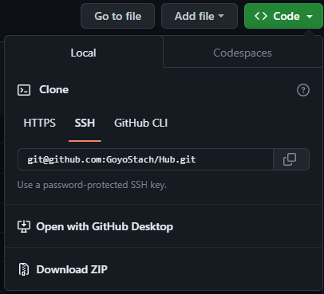

# Multiple git account on same machine
Created : 📅Wednesday 28th May 2025 
Modified: 📅Wednesday 28th May 2025 11:40 

```table-of-contents
title: 
style: nestedList # TOC style (nestedList|nestedOrderedList|inlineFirstLevel)
minLevel: 2 # Include headings from the specified level
maxLevel: 0 # Include headings up to the specified level
include: 
exclude: 
includeLinks: true # Make headings clickable
hideWhenEmpty: false # Hide TOC if no headings are found
debugInConsole: false # Print debug info in Obsidian console
```

## Intro 

Before starting out, this tutorial is a copy of [Rahul Pandey](https://github.com/rahularity) tutorial. It was so useful that i could not risk to loose it and decided to archive it on my own website.


Let suppose I have two github accounts, **https:/<span></span>/github.com<span></span>/goyo-office** and **https:/<span></span>/github.com<span></span>/goyo-personal**. Now i want to setup my mac to easily talk to both the github accounts.

> NOTE: This logic can be extended to more than two accounts also. :)

The setup can be done in 5 easy steps:
## Steps:

- [Step 1](#Step%201)
	- [Create SSH keys for all accounts](#Create%20SSH%20keys%20for%20all%20accounts)
- [Step 2 - MAC OS/LINUX ONLY](#Step%202%20-%20MAC%20OS/LINUX%20ONLY)
	- [Add SSH keys to SSH Agent](#Add%20SSH%20keys%20to%20SSH%20Agent)
- [Step 3](#Step%203)
	- [Add SSH public key to the Github](#Add%20SSH%20public%20key%20to%20the%20Github)
- [Step 4](#Step%204)
	- [Create a Config File and Make Host Entries](#Create%20a%20Config%20File%20and%20Make%20Host%20Entries)
	- [SSO](#SSO)
- [Step 5](#Step%205)
	- [Cloning GitHub repositories using different accounts](#Cloning%20GitHub%20repositories%20using%20different%20accounts)

<br>

## Step 1
### Create SSH keys for all accounts
First make sure your current directory is your **.ssh** folder. Or create it
```sh
     $ cd ~/.ssh
```
Syntax for generating unique ssh key for ann account is:
```sh
     ssh-keygen -t rsa -C "your-email-address" -f "github-username"
```
here,

**-C** stands for comment to help identify your ssh key

**-f** stands for the file name where your ssh key get saved


After entering the command the terminal will ask for passphrase, leave it empty and proceed.


> Now after adding keys , in your .ssh folder, a public key and a private will get generated.

>The public key will have an extention __.pub__ and private key will be there without any extention both having same name which you have passed after __-f__ option in the above command. (in my case __github-goyo-office__ and __github-goyo-personal__)

<br>

## Step 2 - MAC OS/LINUX ONLY
### Add SSH keys to SSH Agent
Now we have the keys but it cannot be used until we add them to the SSH Agent.
```sh
     ssh-add -K ~/.ssh/github-goyo-office
     ssh-add -K ~/.ssh/github-goyo-personal
```

You can read more about adding keys to SSH Agent [here.](https://help.github.com/en/github/authenticating-to-github/generating-a-new-ssh-key-and-adding-it-to-the-ssh-agent)

<br>

## Step 3
### Add SSH public key to the Github
For the next step we need to add our public key (that we have generated in our previous step) and add it to corresponding github accounts.

For doing this we need to:

__1. Copy the public key__

     We can copy the public key either by opening the github-goyo-office.pub file in vim and then copying the content of it.
```sh
     vim ~/.ssh/github-goyo-office.pub
     vim ~/.ssh/github-goyo-personal.pub
```


<p align="center"/>
OR

We can directly copy the content of the public key file in the clipboard.

```sh
     pbcopy < ~/.ssh/github-goyo-office.pub
     pbcopy < ~/.ssh/github-goyo-personal.pub
```   


__2. Paste the public key on Github__

* Sign in to Github Account
* Goto **Settings** > **SSH and GPG keys** > **New SSH Key**
* Paste your copied public key and give it a Title of your choice.

___OR___

* Sign in to Github 
* Paste this link in your browser (https://github.com/settings/keys) or click [here](https://github.com/settings/keys)
* Click on **New SSH Key** and paste your copied key.

<br>

## Step 4
### Create a Config File and Make Host Entries

The **~/.ssh/config** file allows us specify many config options for SSH.

If **config** file not already exists then create one (make sure you are in **~/.ssh** directory)

```sh
     touch config
```

The commands below opens config in your default editor....Likely TextEdit, VS Code.
```sh
     open config
```
Now we need to add these lines to the file, each block corresponding to each account we created earlier.
```config
     #goyo-office account
     Host github.com-office
          HostName github.com
          User git
          IdentityFile ~/.ssh/github-goyo-office

     #goyo-personal account
     Host github.com-goyo
          HostName github.com
          User git
          IdentityFile ~/.ssh/github-goyo-personal
```

<br>

### SSO 
If you are using a SSO, configue it with the dedicated section in the same page.

## Step 5
### Cloning GitHub repositories using different accounts

So we are done with our setups and now its time to see it in action. We will clone a repository using one of the account we have added.

Make a new project folder where you want to clone your repository and go to that directory from your terminal.

You can directly copy the provided link by the hosting service : 
Usually you would get something generic like this : 

You will just need to modify the first part of the link with your costomised alias :

```
git clone git@github.com-{your-account}:GoyoStach/Hub.git

[e.g.] git@github.com-goyo:GoyoStach/Hub.git
```

 ## Finally

From now on, to ensure that our commits and pushes from each repository on the system uses the correct GitHub user — we will have to configure **user.email** and **user.name** in every repository freshly cloned or existing before.

To do this use the following commands.

```git
     git config user.email "my_office_email@gmail.com"
     git config user.name "goyo Office"
     
     git config user.email "my-personal-email@gmail.com"
     git config user.name "goyo Perso"
```
Pick the correct pair for your repository accordingly.

Now you can use:
```git
     git push
     
     git pull
```
#### References

https://gist.github.com/goyoarity/86da20fe3858e6b311de068201d279e3
https://www.theserverside.com/blog/Coffee-Talk-Java-News-Stories-and-Opinions/GitHub-SSH-Windows-Example
Tags : #Code #Windows 


