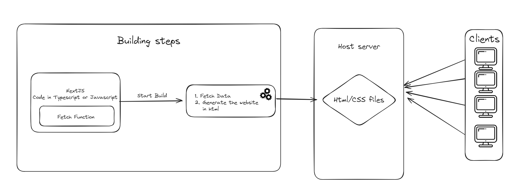
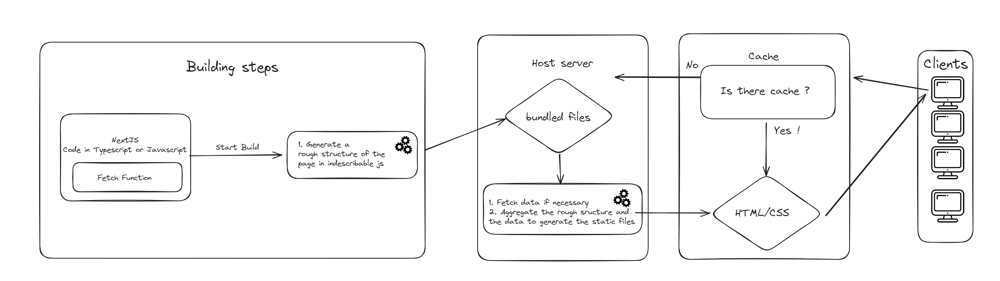
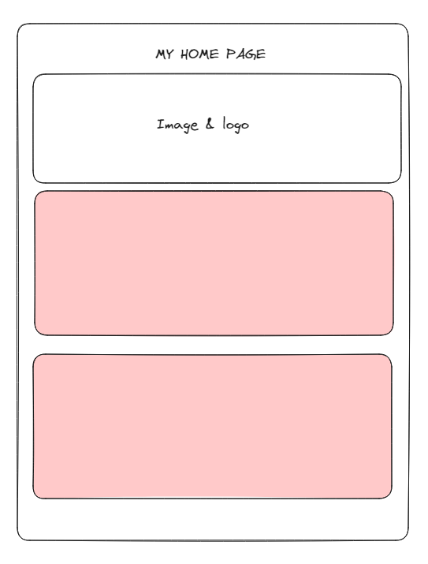
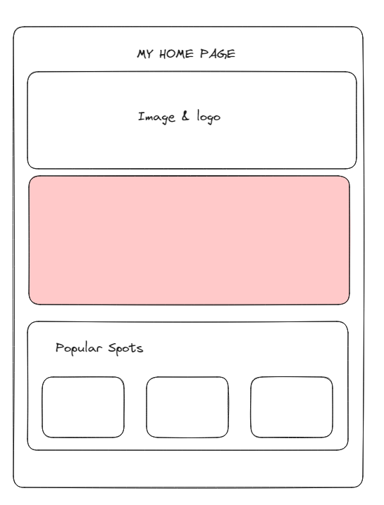
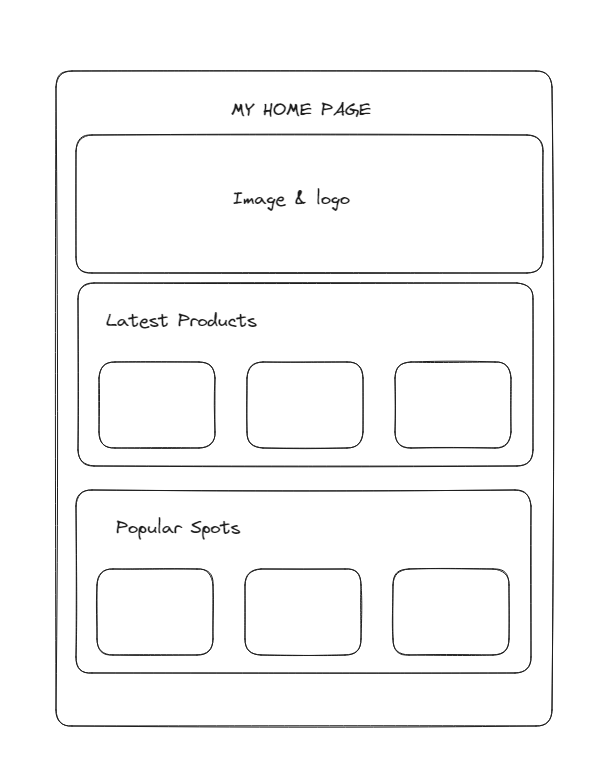

# Rendering strategies in NextJS
Created : 📅Wednesday 28th May 2025 
Modified: 📅Wednesday 28th May 2025 11:40 

```table-of-contents
title: 
style: nestedList # TOC style (nestedList|nestedOrderedList|inlineFirstLevel)
minLevel: 2 # Include headings from the specified level
maxLevel: 0 # Include headings up to the specified level
include: 
exclude: 
includeLinks: true # Make headings clickable
hideWhenEmpty: false # Hide TOC if no headings are found
debugInConsole: false # Print debug info in Obsidian console
```

## Introduction

Next JS is a powerful meta framework developed by Vercel, it draws inspiration in many other framework and try to implement them in their codebase. 
However if you ever try to use this tool, you will soon see that a **lot** of things are happening without you ever writing code about it. 
Even though Vercel like to claim that they are not opinionated on how you code your project, you will soon realize that if you dont work the way Next expect you to you will face many issues and bug. You will mostly find the solution in the official documentation. 

However, even if their documentation is extensive and comprehensive, it describes each topic individually and it's often a bit tricky to see the bigger picture and how they coexist in a real project. It also only scratch the surface of the concept and doesn't dive much in how a complex production ready application should behave. They are merely displaying the capabilities of the framework.

Although I will try through this note to explain as clearly as possible, rendering is an advanced topic and touch on optimisation. I would recommend to have basic knowledge of front end and web in general before trying to deep dive in those subjects.

## Static site generating (SSG)

Static side generation or more commonly called **SSG** is the most primitive way of displaying a web page to the client. It is also the most efficient as you dont ship any javascript to the browser of the user, **only html and CSS**. 

But if you look at what you are writing in your codebase, you are not really writing in `.html` files. So there must be something going on transforming your `.jsx` or `.tsx` files into readable content for your browser.

This is where a core concept of modern front-end takes place. **You have to build your front-end**. This is a mandatory step in order to deploy your website.

And it is precisely at this step that every file that could be statically generated is built.  

It is the most efficient way to send pages to the client and should be your default choice. However it is not perfect which is why most often then whatnot you have to rely on other strategies. 

If your page can live with:
- No interactivity needed
- Static data
You should probably go for it.

Here are a few examples of projects that could fall into this category :
- A blog
- Catalog website
- Recipe website

### Advanced

Next is defaulting to this strategy when fetching and rendering data. Meaning that even though you are fetching from an external source, Next will try to built the page statically. It will only fetch during build time once to generate your static site. 
Here is a quick schema to describe this process.


 
This trick allow to generate a lot of page dynamically at build time and still benefit from the fast load time for the client, as there will be not computing power needed once they request some ressources.

As stated before it can be really smart to use this strategy for semi static data. You can always refresh the data by re-building the website which can be automated through various deployment tools. Also it is a fairly cheap as no computing power will be required once build time is over, you will only be charged traffic which is another reason as to why you should prioritize this method.

**⚠ IF YOU WANT DYNAMIC DATA YOU HAVE TO EXPLICITELY OPT OUT OF THIS STRATEGY ⚠**

## Server Side Rendering (SSR)

Server side rendering is useful in order to generate page on demand. It can be useful for data that needs to be relatively fresh and can't be stale. 
For the browser of the client, SSR is the same as SSG. The goal is for the browser to receive only HTML and CSS. In order to do so while maintaining fresh data, the page will be **generated on demand**. Meaning that each time a client will request a page, a small function on a server will run in order to compute the data and the content of the page. It is then mandatory to have a server with computing power or a service to handle the file generation. 

**⚠ [NEXTJS NEED A SPECIFIC FLAG TO KNOW YOU WANT TO DYNAMICLY REGENERATE THE PAGE ON DEMAND](https://nextjs.org/docs/app/building-your-application/data-fetching/fetching-caching-and-revalidating) ⚠**

Here a simplified schema of typical SSR page.



As you can see, there is a caching strategiy built in NEXT. It is something that is **enabled by default** so you have to specify if you dont want it. You can also decide to customize the duration of the cache. For more details on caching, look at the [official documentation on the subject](https://nextjs.org/docs/app/building-your-application/data-fetching/fetching-caching-and-revalidating). 

This is still a recommended approach as it is one of the fastest way to receive the content to the browser and makes it readable by bots, giving your website great SEO performances.

### Streaming 

One of the downside of this type of rendering is that you have to wait for the page to be built before sending it to the client. Meaning that if you have dependency to slow services, your client wont see content before many seconds. To compensate on this issue, a pattern might be really useful, it is called component streaming. 

Instead of waiting on the whole page to load, the server will send a hollowed version of the page to the client so that the static content can be displayed. The content dependent on the slow services will then be streamed in to fill the blanks. 

The component building process is the exact same concept as described before for the page. Instead of building the whole page, you build the component which will then be sent to the client to complete the page.


I would recommend this method if you have a strong dependency to services.

#### Example: 

On this example, you can send directly to the client the layout with the title and the logo, and then concurrently fetch and generate on the server the two next sections. Those sections will be sent to the client once ready

| Step 1       | Step 2                 | Step 3|
| --------------------------------------------------- | -------------------------------- |--------------------------------- |
|  | || 


This allows for a smoother experience for the user. 
*Tips, you can use skeleton in order to fill in the blank when the ui is still being built on the server.*


## Hydrated client components 

We've seen most of the fundamentals of how nextjs renders our application however we did not talk about one of the most important concept of modern web, **Interactivity**.

In order to add interactivity while maintaining the performance of SSR, a concept called **hydration** comes in play. 
The concept is fairly simple. Similarly to the streaming concept, you will send data to the browser of the client in multiple parts. You will first send the UI without event handling and then hydrate it with javascript. 
This way of hydrating content is commonly (and wrongly) called client component in Next ecosystem. 
A lot of the time people coming from classic React background believes that those component will behave as the usual SPA. However it is fundamentally different !
**It is still being rendered on the server.**

This misconception is accentuated with how you declare in your codebase how those component should be hydrated.
`"use client"`. 

Once again this is still being rendered on the server.
You should if possible use this the least, as it triggers a re-render on the client side once the browser receives the javascript.

However, dont worry too much about it if your main goal is SEO as it is once again rendered on the server and readable by google algorithm for search engine optimization.

*tips: Keep this as local as possible, instead of declaring a whole page as client, try to only declare your interactive component with this rendering method !*

## Conclusion

There is a bunch of other small optimization possible and rendering pattern proposed by Next by they most often relie on these core concepts. If you are able to comprehend and use Next Js different rendering pattern, you will be able to tailor your web application to your needs. The strongest asset of Next is the ability to alternate between the rendering patterns so make the effort to tailor each component to it's best rendering strategy.

### Going further 

The more you will work with Next, the more you should lean towards an island approach to your design. It is a great practice to have as Next leans towards even more abstraction and will probably by default decide for you the best rendering strategy. However understanding how it works under the hood is what makes you a valuable engineer.

If you'd like more control and less opinionated choice, I would advise to look up [Astro](https://docs.astro.build/en/getting-started/). It is a light and efficient programming language which is much more controllable and does way less thing hidden from you. It will allow you to understand even more the rendering strategies and possibilities.

## References
https://nextjs.org/docs/app/building-your-application/routing/loading-ui-and-streaming
https://nextjs.org/docs/app/building-your-application/data-fetching/fetching-caching-and-revalidating
Tags : #NextJS #Code #React


